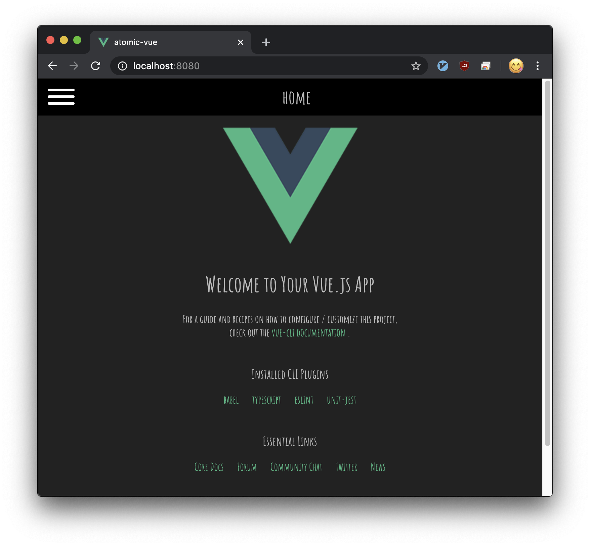
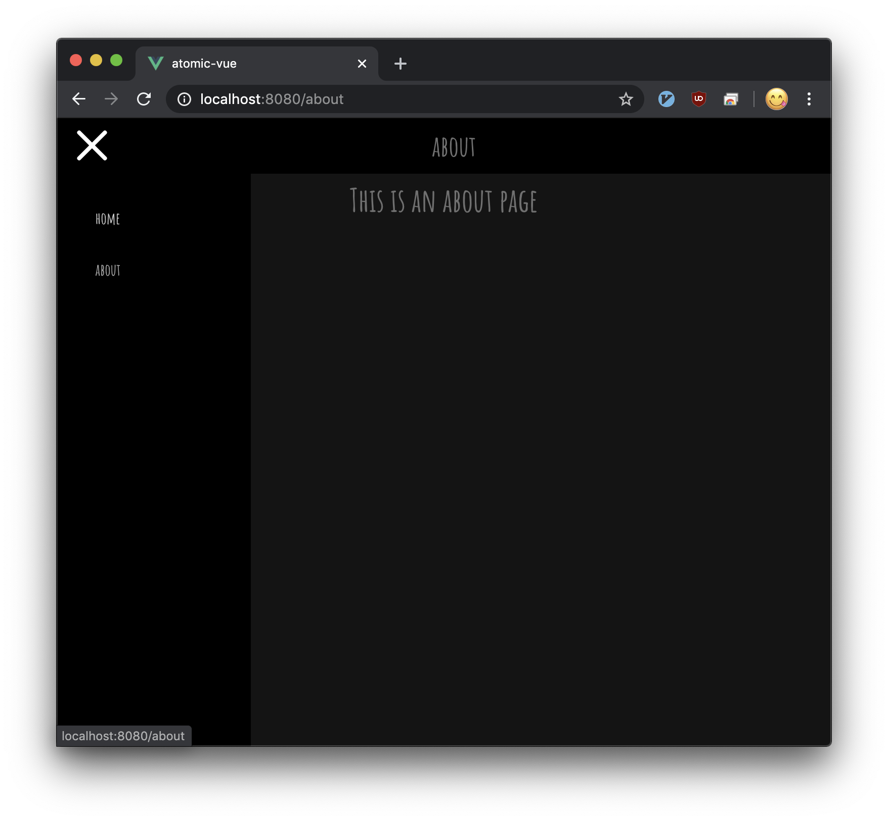

<h1 align="center">
   
  
   
  typescript + vuejs examples.
   
</h1>
<h4 align="center">
   Implemented in a rough feeling.
   The First, implementation of the side menu and header.
   
   
</h4>

# screen shots

# Initial build documentation

[README-PROCEDURE-VUE.md](./README-PROCEDURE-VUE.md)
